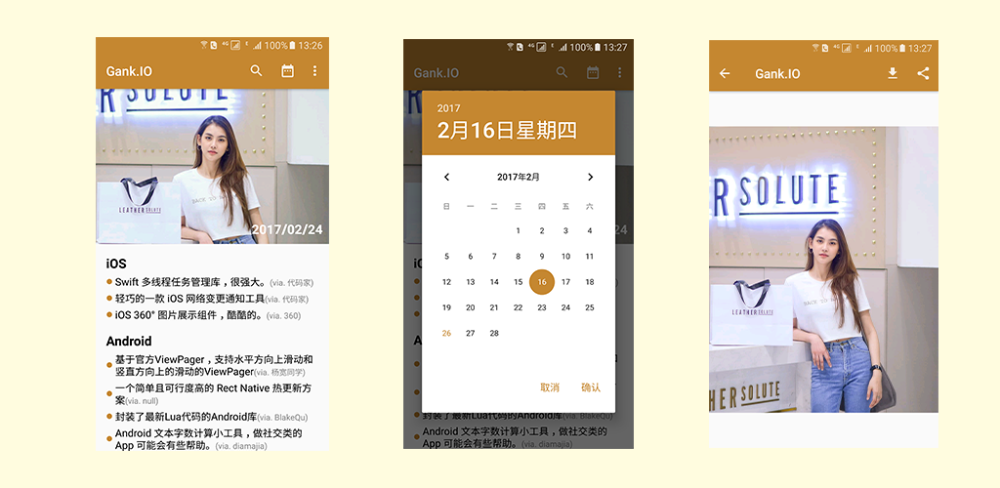

# gank.io [](https://android-arsenal.com/api?level=21)[](https://github.com/iamwent/gank.io/releases/tag/v0.1.1)[](https://github.com/iamwent/gank.io/blob/master/LICENSE)

Yet another Android Client for gank.io


## Screenshots



<br/>

<a href="https://play.google.com/store/apps/details?id=com.iamwent.gank" target="_blank"></a>

## TODO
* [ ] doc
* [ ] more feature
* [ ] open source libraries
* [ ] optimizing

## Thanks

- [Meizhi](https://github.com/drakeet/Meizhi)

## License

```
GNU GENERAL PUBLIC LICENSE Version 3, 29 June 2007

Copyright (C) 2017 iamwent

This program comes with ABSOLUTELY NO WARRANTY.
This is free software, and you are welcome to redistribute it under certain conditions.
```


